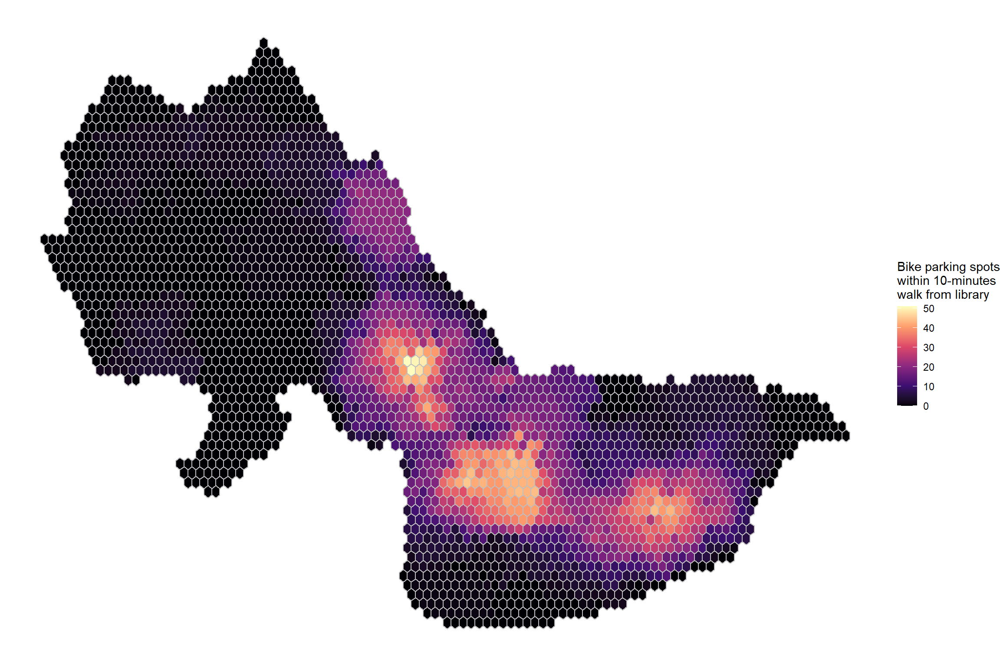

```{r setup, include=FALSE}
knitr::opts_chunk$set(echo = TRUE)
```

This portfolio demonstrates the following skills:
<br>
* Displaying data on an interactive map (see Map # 1) <br>
* Displaying multiple vector layers on the same map (see Map # 2) <br>
* Georeferencing a raster image (see Map # 3) <br>
* Calculating and displaying relationships among point and polygon layers based on distance (see Map # 4) <br>
* Aggregating point data to a layer of polygons (see Map # 5) <br>
* Displaying raster data on a map (see Map # 6) <br>
* Calculating and displaying accessibility, based on travel time (see Maps # 6 and 7) <br>
* Converting between raster layers and vector layers (see Maps # 6 and 7)

# Map 1 (Interactive Map)

This map asks the question of what percentage of Greater Toronto Area residents speak English at home and presents the data in an interactive map format, which allows for readers to zoom in on areas of special interest for them.

For example, according to the most recent census results, in the area of Toronto that my home is located in, the total population is 5,147 and 3,980 or 77.3% speak English.

[](links/toronto_english_map.html){target="_blank"}

# Map 2 (Multiple Vector Layers on the Same Map)

This map asks the question of where police stations in Boston are located and how that relates to the locations of open spaces. The police stations are indicated by small red symbols. 

This spatial representation could possibly shed some light on the safety of open space and how the government prioritizes its resources. We included districts as well which can provide further insight into how the government distributes police stations throughout Boston. Potential areas of future research could include adding demographic data, crime data and how such statistics have changed over time.

[](links/boston_police.pdf){target="_blank"}

# Map 3 (Georeferenced Map)

This map asks the question of what open space is currently in Cambridge and how it compares to the historical parks and cemeteries in Cambridge as of 1993. 

A story emerges about where the City has dedicated its resources since 1993 in developing additional open space.

[](links/cambridge_georef.pdf){target="_blank"}

# Maps 4 and 5 (Relationships Among Point and Polygon Layers Based on Distance and Aggregating Point Data to Polygon Layer)

These maps ask the question of what the relationship is between the locations of public artworks and the locations of public schools and how public schools are distributed throughout neighborhoods.

## Relationships Among Point and Polygon Layers Based on Distance

This map displays data on the locations of public artworks and public schools and how they relate to the locations of neighborhoods. 

[](links/cambridge_art_schools.pdf){target="_blank"}

## Aggregating Point Data to Polygon Layer

This map displays data on the density of public schools within various neighborhoods. 

[](links/cambridge_schools.pdf){target="_blank"}

# Maps 6 and 7 (Converting Vector Data to Raster Data and Back to Vector Data and Visualizing on a Map)

These maps ask the question of what the accessibility is like for people who want to bike to a library. The maps display data about the locations of bike parking spots in reference to the locations of libraries which could be useful for a person who is biking to the library, parking their bike and then walking from the bike parking spot to the library.

## Converting Vector Data to Raster Data

This map was created by converting vector data to raster data showing the number of bike parking spots that can be walked to within 10 minutes from a library.

[](links/cambridge_raster.pdf){target="_blank"}

## Converting Raster Data to Vector Data

This map was created by converting the raster data to a set of polygons showing the number of bike parking spots that can be walked to within 10 minutes from a library.

[](links/cambridge_polygon.pdf){target="_blank"}


